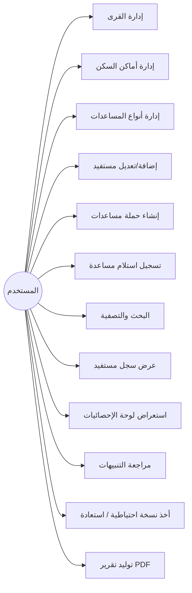
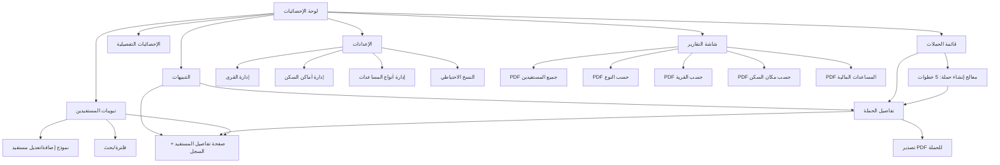

# وثيقة التحليل والتصميم المعماري — تطبيق "تكاتف" لإدارة المساعدات الخيرية

> تطبيق Flutter يعمل بالكامل Offline، بدون تسجيل دخول، لمستخدم واحد، لإدارة توزيع المساعدات الخيرية على البيوت والطلاب والشيبان والمتزوجين.

---

## 0. نظرة عامة على القرار المعماري

قبل الدخول في التفاصيل، القرار الأهم الذي يبني عليه كل شيء آخر:

**نموذج البيانات يعتمد على "جدول مستفيدين موحّد" (Unified Beneficiary Base Table) + جداول فرعية لكل نوع.**

بدل أن تكون البيوت/الطلاب/الشيبان/المتزوجون أربعة جداول منفصلة تماماً لا علاقة بينها، كل مستفيد — أياً كان نوعه — له سجل واحد في جدول `beneficiaries` يحمل الحقول المشتركة (الاسم، القرية، مكان السكن، الهاتف، الملاحظات)، ثم جدول فرعي خاص بنوعه يحمل الحقول الإضافية فقط (Class Table Inheritance).

**لماذا هذا القرار حاسم:** كل الميزات الكبرى في التطبيق — إنشاء حملة، البحث والفلترة، سجل المستفيد، الإحصائيات، التنبيهات، التقارير — تحتاج أن "تنظر" إلى المستفيدين بشكل موحّد بغض النظر عن نوعهم. لو بقيت 4 جداول منفصلة تماماً، كل واحدة من هذه الميزات ستحتاج تكرار المنطق 4 مرات (UNION يدوي معقد، أو 4 شاشات بحث، أو 4 استعلامات إحصائيات). بالنموذج الموحّد، الاستعلام يصبح واحداً مع `WHERE beneficiary_type = ...` عند الحاجة، وموحّداً بلا شرط عند عدم الحاجة.

هذا لا يغيّر شيئاً من تجربة المستخدم الموصوفة (لا يزال هناك 4 نماذج إدخال منفصلة بحقول مختلفة تماماً كما طُلب) — إنه فقط قرار تخزين داخلي.

---

## 1. تحليل المتطلبات الوظيفية (Functional Requirements)

| # | المتطلب |
|---|---|
| FR-1 | إدارة (إضافة/تعديل/حذف/عرض) 4 أنواع مستفيدين: بيوت، طلاب، شيبان، متزوجون |
| FR-2 | إدارة جدول القرى (CRUD) |
| FR-3 | إدارة جدول أماكن السكن (CRUD) |
| FR-4 | إدارة جدول أنواع المساعدات (CRUD)، مع خاصية "يتطلب مبلغاً" لكل نوع |
| FR-5 | إنشاء حملة مساعدات عبر معالج (Wizard) من 6 خطوات: نوع المستفيد ← القرى ← أماكن السكن ← نوع المساعدة ← (مبلغ إن وُجد) ← توليد قائمة تلقائية |
| FR-6 | عرض تفاصيل الحملة وقائمة المستفيدين المشمولين بها مع حالة كل واحد |
| FR-7 | تسجيل استلام المساعدة (تبديل حالة + حفظ تاريخ/وقت الاستلام) |
| FR-8 | بحث سريع بالاسم/الهاتف/القرية/مكان السكن عبر جميع أنواع المستفيدين |
| FR-9 | فلترة حسب: نوع المستفيد، القرية، مكان السكن، نوع المساعدة، حالة الاستلام |
| FR-10 | سجل تاريخي لكل مستفيد يعرض كل الحملات التي شارك فيها وحالته في كل واحدة |
| FR-11 | لوحة إحصائيات شاملة (تفصيل في القسم 16) |
| FR-12 | تنبيهات: مستفيد لم يُخدَم منذ مدة طويلة، ومستفيد متأخر الاستلام في حملة جارية |
| FR-13 | نسخ احتياطي: إنشاء، تصدير، استيراد، استعادة |
| FR-14 | تقارير PDF بستة أنواع (تفصيل في القسم 19)، بتصميم عربي RTL جاهز للطباعة |
| FR-15 | دعم الوضع الليلي/الفاتح |

## 2. تحليل المتطلبات غير الوظيفية (Non-Functional Requirements)

| # | المتطلب | التفصيل |
|---|---|---|
| NFR-1 | العمل بدون إنترنت بالكامل | لا استدعاءات شبكة إطلاقاً؛ قاعدة بيانات محلية فقط |
| NFR-2 | الأداء | فتح أي شاشة قائمة (حتى بآلاف المستفيدين) في أقل من 300ms؛ استعلامات مفهرسة |
| NFR-3 | سهولة الاستخدام لكبار السن | أزرار كبيرة، تباين ألوان عالٍ، خطوط قابلة للتكبير، خطوات بسيطة غير متداخلة |
| NFR-4 | الموثوقية | لا فقدان بيانات عند إغلاق مفاجئ؛ معاملات (Transactions) ذرية عند إنشاء الحملات |
| NFR-5 | إمكانية التوسع | فصل طبقة البيانات عبر Repository Interfaces تسمح لاحقاً بإضافة مزامنة سحابية دون إعادة هيكلة |
| NFR-6 | التدويل | عربي بالكامل، RTL افتراضي، تنسيق تواريخ هجري/ميلادي قابل للتهيئة |
| NFR-7 | قابلية الصيانة | Clean Architecture + فصل واضح بين Domain/Data/Presentation |
| NFR-8 | إمكانية الاختبار | Use Cases وRepositories قابلة للاختبار بمعزل عن Flutter/DB عبر الواجهات |
| NFR-9 | حجم قاعدة البيانات | يجب أن تتحمل عشرات الآلاف من السجلات دون تدهور ملحوظ |

## 3. حالات الاستخدام (Use Cases)

فاعل واحد فقط: **المستخدم (مسؤول توزيع المساعدات)**.



كل حالة استخدام مفصّلة لاحقاً ضمن "الشاشات" و"سير العمل" (الأقسام 10، 13، 14).

## 4. اختيار قاعدة البيانات: Drift

| المعيار | Drift (SQLite) | Isar |
|---|---|---|
| طبيعة البيانات | علائقية بامتياز: مستفيدون ↔ قرى ↔ أماكن سكن ↔ حملات ↔ (N:M) | كائنية NoSQL، علاقات يدوية |
| الإحصائيات (`COUNT`, `GROUP BY`, `SUM`, تجميعات شهرية) | أصلي في SQL، أداء ممتاز عبر فهارس | يتطلب حساباً يدوياً في Dart بعد جلب الكائنات |
| استعلامات الحملة المعقدة (تقاطع نوع + عدة قرى + عدة أماكن سكن) | `WHERE ... IN (...) AND ... IN (...)` مباشرة | يتطلب فلترة يدوية متعددة المراحل |
| علاقات N:M (حملة ↔ قرى، حملة ↔ أماكن سكن) | جداول ربط قياسية | غير مدعومة أصلياً، تحتاج Backlinks معقدة |
| التحقق من الاستعلامات وقت الترجمة | نعم (type-safe SQL builder) | جزئي |
| الترحيلات (Migrations) عند تطوير المخطط | نظام Migration ناضج ومُصرَّح | أضعف نسبياً |
| البث التفاعلي للواجهة (Streams) | مدعوم (`.watch()`) | مدعوم أيضاً |
| سرعة الكتابة/القراءة الخام لكائن مفرد | جيدة | أسرع قليلاً |

**القرار: Drift.** التطبيق تقاريري وإحصائي بطبيعته (لوحة إحصائيات، تقارير PDF متعددة، فلاتر متقاطعة، علاقات N:M بين الحملات والقرى/أماكن السكن). هذا بالضبط ما تتفوق فيه قاعدة بيانات علائقية مع SQL حقيقي. Isar أفضل في تخزين كائنات مستقلة بحث سريع بالمفتاح (مثل تطبيق ملاحظات)، وهو ليس نمط هذا التطبيق.

## 5. تصميم قاعدة البيانات

### 5.1 الجداول المرجعية (Lookup Tables)

```sql
-- القرى
villages(
  id            INTEGER PRIMARY KEY AUTOINCREMENT,
  name          TEXT NOT NULL UNIQUE,
  notes         TEXT NULL,
  created_at    DATETIME NOT NULL DEFAULT CURRENT_TIMESTAMP
)

-- أماكن السكن
residence_places(
  id            INTEGER PRIMARY KEY AUTOINCREMENT,
  name          TEXT NOT NULL UNIQUE,
  created_at    DATETIME NOT NULL DEFAULT CURRENT_TIMESTAMP
)

-- أنواع المساعدات
aid_types(
  id              INTEGER PRIMARY KEY AUTOINCREMENT,
  name            TEXT NOT NULL UNIQUE,     -- سلة غذائية، لحوم، مبلغ مالي...
  requires_amount BOOLEAN NOT NULL DEFAULT 0, -- يتحكم بظهور حقل "المبلغ لكل مستفيد"
  created_at      DATETIME NOT NULL DEFAULT CURRENT_TIMESTAMP
)
```

### 5.2 جدول المستفيدين الموحّد + الجداول الفرعية

```sql
-- الجدول الأساسي المشترك لكل الأنواع
beneficiaries(
  id                  INTEGER PRIMARY KEY AUTOINCREMENT,
  beneficiary_type    TEXT NOT NULL CHECK(beneficiary_type IN
                       ('household','student','elderly','married')),
  primary_name        TEXT NOT NULL,   -- رب الأسرة / اسم الطالب / اسم الشايب / اسم المتزوج
  village_id          INTEGER NOT NULL REFERENCES villages(id),
  residence_place_id  INTEGER NOT NULL REFERENCES residence_places(id),
  phone               TEXT NULL,
  notes               TEXT NULL,
  is_active           BOOLEAN NOT NULL DEFAULT 1,   -- للأرشفة الناعمة بدل الحذف الفعلي
  created_at          DATETIME NOT NULL DEFAULT CURRENT_TIMESTAMP,
  updated_at          DATETIME NOT NULL DEFAULT CURRENT_TIMESTAMP
)

-- بيانات إضافية خاصة بالبيوت فقط (1:1 مع beneficiaries حيث type='household')
households(
  beneficiary_id        INTEGER PRIMARY KEY REFERENCES beneficiaries(id) ON DELETE CASCADE,
  wife_name             TEXT NULL,
  family_members_count  INTEGER NOT NULL DEFAULT 1
)

-- بيانات إضافية خاصة بالطلاب فقط
students(
  beneficiary_id   INTEGER PRIMARY KEY REFERENCES beneficiaries(id) ON DELETE CASCADE,
  school_name      TEXT NOT NULL,
  education_stage  TEXT NOT NULL,   -- ابتدائي/إعدادي/ثانوي/جامعي
  class_grade      TEXT NOT NULL    -- الصف
)

-- بيانات إضافية خاصة بالشيبان فقط
elderly(
  beneficiary_id   INTEGER PRIMARY KEY REFERENCES beneficiaries(id) ON DELETE CASCADE,
  age              INTEGER NOT NULL
)

-- بيانات إضافية خاصة بالمتزوجين فقط
married(
  beneficiary_id   INTEGER PRIMARY KEY REFERENCES beneficiaries(id) ON DELETE CASCADE,
  marriage_date    DATE NOT NULL
)
```

> **ملاحظة تنفيذية:** الإدراج/التعديل لأي مستفيد يتم ضمن `transaction` واحدة تكتب صفاً في `beneficiaries` وصفاً في الجدول الفرعي المطابق معاً، حتى لا يبقى سجل يتيم.

### 5.3 الحملات والتوزيع

```sql
-- الحملة نفسها
campaigns(
  id                      INTEGER PRIMARY KEY AUTOINCREMENT,
  name                    TEXT NOT NULL,          -- مثال: "حملة رمضان 1447 - سلة غذائية"
  beneficiary_type        TEXT NOT NULL CHECK(beneficiary_type IN
                           ('household','student','elderly','married')),
  aid_type_id             INTEGER NOT NULL REFERENCES aid_types(id),
  amount_per_beneficiary  DECIMAL NULL,   -- يُملأ فقط إذا aid_types.requires_amount = 1
  notes                   TEXT NULL,
  created_at              DATETIME NOT NULL DEFAULT CURRENT_TIMESTAMP
)

-- ربط N:M بين الحملة والقرى المشمولة
campaign_villages(
  campaign_id  INTEGER NOT NULL REFERENCES campaigns(id) ON DELETE CASCADE,
  village_id   INTEGER NOT NULL REFERENCES villages(id),
  PRIMARY KEY (campaign_id, village_id)
)

-- ربط N:M بين الحملة وأماكن السكن المشمولة
campaign_residence_places(
  campaign_id          INTEGER NOT NULL REFERENCES campaigns(id) ON DELETE CASCADE,
  residence_place_id   INTEGER NOT NULL REFERENCES residence_places(id),
  PRIMARY KEY (campaign_id, residence_place_id)
)

-- القائمة الفعلية للتوزيع: صف واحد لكل (حملة، مستفيد)
campaign_beneficiaries(
  id              INTEGER PRIMARY KEY AUTOINCREMENT,
  campaign_id     INTEGER NOT NULL REFERENCES campaigns(id) ON DELETE CASCADE,
  beneficiary_id  INTEGER NOT NULL REFERENCES beneficiaries(id),
  status          TEXT NOT NULL DEFAULT 'pending' CHECK(status IN ('pending','received')),
  amount          DECIMAL NULL,         -- نسخة من amount_per_beneficiary وقت الإنشاء (قابلة للتعديل الفردي لاحقاً)
  received_at     DATETIME NULL,        -- تاريخ + وقت الاستلام معاً
  created_at      DATETIME NOT NULL DEFAULT CURRENT_TIMESTAMP,
  UNIQUE(campaign_id, beneficiary_id)
)
```

هذا الجدول الأخير (`campaign_beneficiaries`) هو قلب النظام: منه تُبنى شاشة تفاصيل الحملة، سجل المستفيد، الإحصائيات المالية، والتنبيهات.

### 5.4 الفهارس (Indexes) الضرورية للأداء

```sql
CREATE INDEX idx_beneficiaries_type       ON beneficiaries(beneficiary_type);
CREATE INDEX idx_beneficiaries_village    ON beneficiaries(village_id);
CREATE INDEX idx_beneficiaries_residence  ON beneficiaries(residence_place_id);
CREATE INDEX idx_beneficiaries_phone      ON beneficiaries(phone);
CREATE INDEX idx_beneficiaries_name       ON beneficiaries(primary_name);
CREATE INDEX idx_campaign_beneficiaries_campaign ON campaign_beneficiaries(campaign_id);
CREATE INDEX idx_campaign_beneficiaries_beneficiary ON campaign_beneficiaries(beneficiary_id);
CREATE INDEX idx_campaign_beneficiaries_status ON campaign_beneficiaries(status);
```

## 6. مخطط ERD

```mermaid
erDiagram
    VILLAGES ||--o{ BENEFICIARIES : "تضم"
    RESIDENCE_PLACES ||--o{ BENEFICIARIES : "تضم"
    BENEFICIARIES ||--o| HOUSEHOLDS : "تفاصيل إضافية"
    BENEFICIARIES ||--o| STUDENTS : "تفاصيل إضافية"
    BENEFICIARIES ||--o| ELDERLY : "تفاصيل إضافية"
    BENEFICIARIES ||--o| MARRIED : "تفاصيل إضافية"
    AID_TYPES ||--o{ CAMPAIGNS : "تُستخدم في"
    CAMPAIGNS ||--o{ CAMPAIGN_VILLAGES : ""
    VILLAGES ||--o{ CAMPAIGN_VILLAGES : ""
    CAMPAIGNS ||--o{ CAMPAIGN_RESIDENCE_PLACES : ""
    RESIDENCE_PLACES ||--o{ CAMPAIGN_RESIDENCE_PLACES : ""
    CAMPAIGNS ||--o{ CAMPAIGN_BENEFICIARIES : "تولّد"
    BENEFICIARIES ||--o{ CAMPAIGN_BENEFICIARIES : "يشارك في"

    VILLAGES {
        int id PK
        string name
    }
    RESIDENCE_PLACES {
        int id PK
        string name
    }
    AID_TYPES {
        int id PK
        string name
        bool requires_amount
    }
    BENEFICIARIES {
        int id PK
        string beneficiary_type
        string primary_name
        int village_id FK
        int residence_place_id FK
        string phone
        string notes
    }
    HOUSEHOLDS {
        int beneficiary_id PK_FK
        string wife_name
        int family_members_count
    }
    STUDENTS {
        int beneficiary_id PK_FK
        string school_name
        string education_stage
        string class_grade
    }
    ELDERLY {
        int beneficiary_id PK_FK
        int age
    }
    MARRIED {
        int beneficiary_id PK_FK
        date marriage_date
    }
    CAMPAIGNS {
        int id PK
        string name
        string beneficiary_type
        int aid_type_id FK
        decimal amount_per_beneficiary
    }
    CAMPAIGN_VILLAGES {
        int campaign_id FK
        int village_id FK
    }
    CAMPAIGN_RESIDENCE_PLACES {
        int campaign_id FK
        int residence_place_id FK
    }
    CAMPAIGN_BENEFICIARIES {
        int id PK
        int campaign_id FK
        int beneficiary_id FK
        string status
        decimal amount
        datetime received_at
    }
```

## 7. شرح العلاقات

- **قرية 1—N مستفيد، مكان سكن 1—N مستفيد**: كل مستفيد ينتمي لقرية واحدة ومكان سكن واحد بالضبط (كما ورد في المتطلبات: تُختار من قائمة، لا تُكتب يدوياً).
- **مستفيد 1—1 (اختيارية) مع الجدول الفرعي المطابق لنوعه**: مستفيد من النوع `household` له بالضبط صف واحد في `households` ولا شيء في الجداول الثلاثة الأخرى. هذا التزام على مستوى منطق التطبيق (Repository)، وليس قيداً يفرضه SQLite مباشرة.
- **نوع مساعدة 1—N حملة**: نفس نوع المساعدة (مثلاً "سلة غذائية") يمكن استخدامه في حملات متعددة عبر الزمن.
- **حملة N—M قرى، حملة N—M أماكن سكن**: عبر جدولي الربط `campaign_villages` و`campaign_residence_places` — لأن الحملة الواحدة قد تشمل عدة قرى وعدة أماكن سكن معاً.
- **حملة 1—N campaign_beneficiaries، مستفيد 1—N campaign_beneficiaries**: كل صف في `campaign_beneficiaries` هو تقاطع (حملة × مستفيد) واحد — وهذا الجدول هو **سجل المستفيد** الكامل عبر الزمن إذا جُمعت كل صفوفه لمستفيد معيّن وربطت بجدول `campaigns`.

## 8. هيكل المشروع وفق Clean Architecture

```
lib/
├── main.dart
├── app.dart                          # MaterialApp, Theme, Locale (ar, RTL)
│
├── core/
│   ├── di/                           # get_it + injectable — تسجيل التبعيات
│   ├── database/
│   │   ├── app_database.dart         # Drift Database class + migrations
│   │   ├── tables/                   # تعريفات جداول Drift (Villages, ResidencePlaces, ...)
│   │   └── daos/                     # BeneficiariesDao, CampaignsDao, ...
│   ├── theme/                        # ColorScheme, TextTheme (Material 3)
│   ├── router/                       # go_router: تعريف كل المسارات
│   ├── constants/                    # enums: BeneficiaryType, CampaignStatus...
│   ├── utils/                        # date_formatter, validators, debouncer
│   └── errors/                       # Failure/Exception classes
│
├── features/
│   ├── villages/
│   │   ├── domain/{entities,repositories,usecases}/
│   │   ├── data/{models,repositories_impl}/
│   │   └── presentation/{cubit,pages,widgets}/
│   ├── residence_places/             # نفس البنية
│   ├── aid_types/                    # نفس البنية
│   │
│   ├── beneficiaries/                # مستفيد واحد موحّد بـ 4 نماذج فرعية
│   │   ├── domain/
│   │   │   ├── entities/ (Beneficiary, HouseholdDetails, StudentDetails, ...)
│   │   │   ├── repositories/ (BeneficiaryRepository)
│   │   │   └── usecases/ (AddHousehold, AddStudent, SearchBeneficiaries, ...)
│   │   ├── data/
│   │   └── presentation/
│   │       ├── cubit/ (BeneficiaryListCubit, BeneficiaryFormCubit)
│   │       └── pages/ (per type: household_form_page.dart, ...)
│   │
│   ├── campaigns/
│   │   ├── domain/usecases/ (CreateCampaign, GenerateDistributionList, MarkAsReceived)
│   │   ├── data/
│   │   └── presentation/ (campaign_wizard/, campaign_details_page.dart)
│   │
│   ├── search_filter/                # منطق فلترة مشترك يُستهلك من عدة شاشات
│   ├── statistics/                   # dashboard_page.dart + charts widgets
│   ├── alerts/                       # alerts_page.dart + AlertsCubit
│   ├── backup/                       # backup_page.dart + BackupService
│   └── reports/                      # reports_page.dart + pdf/ generators
│
└── l10n/                             # ملفات الترجمة العربية
```

**قاعدة الاعتماد (Dependency Rule):** `presentation` يعتمد على `domain` فقط. `data` يعتمد على `domain` (لتنفيذ الواجهات). `domain` لا يعتمد على أي شيء خارج Dart القياسية — لا Flutter ولا Drift. هذا ما يسمح لاحقاً باستبدال Drift بأي مصدر بيانات آخر (API سحابي مثلاً) دون لمس Domain أو Presentation.

## 9. تقسيم Modules

| Module | المسؤولية | يعتمد على |
|---|---|---|
| `core/database` | تعريف كل الجداول والـ DAOs، الترحيلات | — |
| `villages`, `residence_places`, `aid_types` | CRUD بسيط لكل جدول مرجعي | `core` |
| `beneficiaries` | إدارة الأنواع الأربعة، البحث، سجل المستفيد | `core`, `villages`, `residence_places` |
| `campaigns` | معالج الإنشاء، التوزيع، تسجيل الاستلام | `core`, `beneficiaries`, `aid_types` |
| `statistics` | تجميع بيانات الإحصائيات والرسوم البيانية | `core` (استعلامات مباشرة عبر DAOs) |
| `alerts` | حساب المستفيدين المتأخرين | `core`, `campaigns` |
| `backup` | نسخ/استيراد ملف قاعدة البيانات | `core` |
| `reports` | توليد PDF لكل الأنواع الستة | `core`, `beneficiaries`, `campaigns` |

## 10. الشاشات (Screens) — القائمة الكاملة

### 10.1 الشاشة الرئيسية / لوحة الإحصائيات (`DashboardPage`)
- بطاقات إحصائية علوية (Grid) + رسوم بيانية + شريط تنبيهات علوي إن وُجدت + أزرار وصول سريع ("حملة جديدة"، "مستفيد جديد").

### 10.2 شاشات المستفيدين
- `BeneficiaryTypeTabsPage`: تبويبات (بيوت / طلاب / شيبان / متزوجون)، كل تبويب قائمة + FAB إضافة + شريط بحث + زر فلترة.
- `HouseholdFormPage` / `StudentFormPage` / `ElderlyFormPage` / `MarriedFormPage`: نماذج إدخال مطابقة تماماً للحقول المذكورة في المتطلبات، مع Dropdown للقرية ومكان السكن (مع خيار "إضافة جديد" سريع داخل الـ Dropdown نفسه).
- `BeneficiaryDetailsPage`: البيانات الكاملة أعلى الصفحة، ثم Timeline لسجل المساعدات (تفصيل في 10.7).

### 10.3 الجداول المرجعية
- `VillagesManagementPage`, `ResidencePlacesManagementPage`, `AidTypesManagementPage`: قائمة بسيطة + إضافة/تعديل/حذف (مع تحذير حذف إذا كان الجدول مرتبطاً بمستفيدين).

### 10.4 معالج إنشاء حملة (`CampaignWizardPage`) — Stepper من 5 خطوات
1. اختيار نوع المستفيد (بطاقات كبيرة قابلة للنقر).
2. اختيار القرى (قائمة اختيار متعدد Checkboxes + بحث).
3. اختيار أماكن السكن (نفس النمط).
4. اختيار نوع المساعدة (قائمة من `aid_types`)؛ إذا `requires_amount = true` يظهر فورياً حقل "المبلغ لكل مستفيد" (Animated reveal).
5. شاشة مراجعة: عرض عدد المستفيدين المطابقين تلقائياً *قبل* الحفظ (Live preview count) + زر "إنشاء الحملة".

### 10.5 تفاصيل الحملة (`CampaignDetailsPage`)
- رأس الصفحة: اسم الحملة، النوع، القرى/الأماكن المشمولة، نوع المساعدة، عداد (تم الاستلام X / الإجمالي Y).
- قائمة المستفيدين مع Checkbox أمام كل اسم؛ ضغطة واحدة تحوّل الحالة إلى "✅ تم الاستلام" وتُسجّل الوقت فوراً (مع إمكانية التراجع بضغطة ثانية خلال نافذة قصيرة أو من قائمة خيارات الصف).
- زر عائم "تصدير PDF" لهذه الحملة تحديداً.

### 10.6 البحث والفلترة
- شريط بحث عام متاح من الشاشة الرئيسية (بحث فوري Debounced عبر كل الحقول: اسم/هاتف/قرية/مكان سكن، عبر كل الأنواع).
- `FilterBottomSheet`: قابل للفتح من أي شاشة قائمة، يحتوي فلاتر: نوع المستفيد، القرية (متعدد)، مكان السكن (متعدد)، نوع المساعدة، حالة الاستلام.

### 10.7 سجل المستفيد (ضمن `BeneficiaryDetailsPage`)
- Timeline عمودي: لكل حملة شارك فيها المستفيد → اسم الحملة/المناسبة، نوع المساعدة، الحالة (✅ تم الاستلام بتاريخ ووقت / ⏳ لم يستلم).

### 10.8 لوحة الإحصائيات التفصيلية (`StatisticsPage`)
تفصيل كامل في القسم 16.

### 10.9 التنبيهات (`AlertsPage`)
- تبويبان: "لم يُخدم منذ فترة طويلة" و"متأخرون في حملة حالية"، كل عنصر قابل للنقر للانتقال مباشرة لصفحة المستفيد/الحملة.

### 10.10 النسخ الاحتياطي (`BackupPage`)
- أزرار: إنشاء نسخة احتياطية الآن، تصدير إلى مكان يختاره المستخدم، استيراد من ملف، استعادة (مع تحذير واضح بأنها تستبدل البيانات الحالية وتأكيد مزدوج).
- قائمة بآخر النسخ المحفوظة محلياً مع التاريخ والحجم.

### 10.11 التقارير (`ReportsPage`)
تفصيل كامل في القسم 19.

### 10.12 الإعدادات (`SettingsPage`)
- الوضع الليلي/الفاتح، حجم الخط، حد "التنبيه بعد X يوم بدون مساعدة" القابل للتخصيص، شعار الجمعية (لتضمينه في PDF).

## 11. مخطط تدفق التنقل (Navigation Flow)



## 12. عمليات CRUD

| الكيان | إضافة | تعديل | حذف | ملاحظات الحذف |
|---|---|---|---|---|
| القرى | ✓ | ✓ | ✓ | يُمنع الحذف إذا كانت مستخدمة في `beneficiaries` أو `campaign_villages`؛ يُقترح دمج/إعادة تعيين بدلاً من الحذف |
| أماكن السكن | ✓ | ✓ | ✓ | نفس المنطق أعلاه |
| أنواع المساعدات | ✓ | ✓ | ✓ (أرشفة ناعمة) | لا يُحذف فعلياً إن استُخدم في حملة سابقة — فقط يُخفى من قوائم الاختيار الجديدة (`is_archived`) حفاظاً على تاريخ التقارير |
| المستفيدون (4 أنواع) | ✓ | ✓ | ✓ (أرشفة ناعمة عبر `is_active`) | الحذف الفعلي فقط إذا لم يشارك في أي حملة إطلاقاً؛ وإلا أرشفة لحفظ سلامة السجل التاريخي |
| الحملات | ✓ (عبر المعالج) | ✓ (تعديل بيانات وصفية فقط، لا يُعاد توليد القائمة) | ✓ (مع تأكيد، يحذف `campaign_beneficiaries` تبعاً) | — |
| `campaign_beneficiaries` | تُولَّد تلقائياً | تعديل الحالة (استلام/إلغاء استلام) والمبلغ الفردي | لا يُحذف مستقل، فقط ضمن حذف الحملة | — |

## 13. آلية إنشاء حملة المساعدات (تفصيل تقني)

بعد إتمام خطوات المعالج (النوع، القرى، أماكن السكن، نوع المساعدة، المبلغ إن وُجد)، عند الضغط على "حفظ":

```sql
-- 1) إدراج صف campaigns
-- 2) إدراج صفوف campaign_villages وcampaign_residence_places
-- 3) الاستعلام الذي يولّد قائمة التوزيع تلقائياً:
SELECT b.id FROM beneficiaries b
WHERE b.beneficiary_type = :selectedType
  AND b.is_active = 1
  AND b.village_id IN (:selectedVillageIds)
  AND b.residence_place_id IN (:selectedResidencePlaceIds)

-- 4) لكل نتيجة: إدراج صف في campaign_beneficiaries
--    (campaign_id, beneficiary_id, status='pending', amount=amount_per_beneficiary)
```

تُنفَّذ الخطوات 1-4 كلها داخل **معاملة واحدة (`db.transaction`)** لضمان عدم وجود حملة بلا قائمة توزيع إذا فشلت خطوة في المنتصف. شاشة المراجعة (الخطوة 5 في المعالج) تعرض نفس استعلام SELECT كـ Live Preview *قبل* الحفظ الفعلي، حتى يتأكد المستخدم من العدد قبل الإنشاء.

## 14. آلية التوزيع وتسجيل الاستلام

- شاشة تفاصيل الحملة تعرض `campaign_beneficiaries` مربوطة بـ `beneficiaries` (JOIN) لعرض الاسم/القرية/الهاتف.
- ضغطة Checkbox → `UPDATE campaign_beneficiaries SET status='received', received_at=CURRENT_TIMESTAMP WHERE id=:id`.
- إلغاء الاستلام (تصحيح خطأ) → `UPDATE ... SET status='pending', received_at=NULL`.
- الشاشة تستخدم Drift `.watch()` على هذا الاستعلام، فيتحدّث العداد (تم الاستلام X / Y) تلقائياً بدون إعادة تحميل يدوية.

## 15. آلية البحث والتصفية

- البحث السريع يُبنى كاستعلام واحد موحّد على `beneficiaries` (بفضل التصميم في القسم 0):

```sql
SELECT * FROM beneficiaries
WHERE primary_name LIKE '%:q%' OR phone LIKE '%:q%'
   OR village_id IN (SELECT id FROM villages WHERE name LIKE '%:q%')
   OR residence_place_id IN (SELECT id FROM residence_places WHERE name LIKE '%:q%')
```

مع `debounce` بـ 300ms على حقل النص لتفادي استعلام لكل ضغطة مفتاح.

- الفلاتر (نوع مستفيد/قرية/مكان سكن/نوع مساعدة/حالة استلام) تُبنى كشروط `AND` تُضاف ديناميكياً لنفس الاستعلام عبر Drift's composable `Expression<bool>`؛ فلتر "نوع المساعدة" و"حالة الاستلام" يتطلبان `JOIN` مع `campaign_beneficiaries` + `campaigns`.

## 16. لوحة الإحصائيات والتقارير الرقمية

| البطاقة/الرسم | مصدر البيانات |
|---|---|
| إجمالي بيوت/طلاب/شيبان/متزوجين | `COUNT(*) GROUP BY beneficiary_type` |
| إجمالي المستفيدين | `COUNT(*) FROM beneficiaries WHERE is_active=1` |
| إجمالي الحملات | `COUNT(*) FROM campaigns` |
| مساعدات تم تسليمها / لم تُسلّم | `COUNT(*) FROM campaign_beneficiaries GROUP BY status` |
| أكثر القرى استفادة | `COUNT(*) FROM campaign_beneficiaries JOIN beneficiaries JOIN villages GROUP BY village_id ORDER BY COUNT DESC` |
| أكثر أماكن السكن استفادة | نفس المنطق مع `residence_place_id` |
| أكثر أنواع المساعدات توزيعاً | `COUNT(*) FROM campaign_beneficiaries JOIN campaigns GROUP BY aid_type_id ORDER BY COUNT DESC` |
| إجمالي المبالغ المالية المصروفة | `SUM(amount) FROM campaign_beneficiaries WHERE status='received' AND campaign أنواع مساعداتها requires_amount=1` |
| عدد المستفيدين لكل قرية/مكان سكن | `COUNT(*) GROUP BY village_id` / `residence_place_id` |
| رسم بياني شهري | `COUNT(*) FROM campaign_beneficiaries WHERE status='received' GROUP BY strftime('%Y-%m', received_at)` → مخطط أعمدة (`fl_chart` BarChart) |
| رسم دائري لأنواع المستفيدين | نسبة `beneficiary_type` → (`fl_chart` PieChart) |

كل الاستعلامات مبنية عبر DAOs مخصصة (`StatisticsDao`) تُعيد نتائج مجمّعة جاهزة للعرض، لا حسابات في طبقة الواجهة.

## 17. نظام التنبيهات

1. **"لم يُخدم منذ فترة طويلة"**: لكل مستفيد نشط، `MAX(received_at)` من كل صفوفه في `campaign_beneficiaries` حيث `status='received'`. إن كانت `NULL` (لم يستلم شيئاً قط منذ التسجيل) أو أقدم من عتبة قابلة للتخصيص من الإعدادات (افتراضياً 90 يوماً) → يظهر في قائمة التنبيهات.
2. **"متأخر في حملة حالية"**: أي صف في `campaign_beneficiaries` بحالة `pending` ضمن حملة لم يمضِ على إنشائها وقت طويل (تُعتبر "حالية" آخر N حملة أو حملات آخر 30 يوماً — قابل للتخصيص) — تُجمَّع في تبويب منفصل بالشاشة.

كلا الاستعلامين محسوبان عند فتح الشاشة (وليسا Background job، إذ لا حاجة لإشعارات فعلية في هذه المرحلة — انظر التوسعات المستقبلية للإشعارات الفعلية).

## 18. النسخ الاحتياطي والاستيراد/التصدير

- ملف قاعدة بيانات SQLite (`app_database.sqlite`) هو وحدة النسخ الاحتياطي الكاملة (كل الجداول في ملف واحد).
- **إنشاء نسخة احتياطية**: نسخ الملف إلى مجلد تطبيق مخصص (`getApplicationSupportDirectory()/backups/`) باسم يتضمن الطابع الزمني.
- **تصدير**: نفس النسخة، لكن يُطلب من المستخدم اختيار وجهة عبر `file_picker` (Storage Access Framework على أندرويد) — لنقلها لهاتف آخر أو تخزين سحابي عام (جوجل درايف عبر مشاركة الملف).
- **استيراد/استعادة**: اختيار ملف `.sqlite` عبر `file_picker`، تحقق من صحة بنيته (فتح تجريبي + التحقق من وجود الجداول المتوقعة)، ثم استبدال الملف الحالي **بعد تأكيد صريح من المستخدم** (نسخ احتياطي تلقائي للحالة الحالية قبل الاستبدال كشبكة أمان).
- تُنفَّذ عملية الاستبدال بعد إغلاق اتصال Drift الحالي بالكامل، ثم إعادة تهيئته.

## 19. نظام التقارير وتصدير PDF

**المكتبات:** حزمة `pdf` (بناء المستند) + `printing` (معاينة/طباعة/مشاركة) + خط عربي مضمّن (Cairo أو Amiri TTF) + `pdf`'s `TextDirection.rtl` على مستوى المستند بالكامل.

**قالب مشترك لكل التقارير** (`ReportTemplate`):
- ترويسة: شعار الجمعية (إن وُجد من الإعدادات) + عنوان التقرير + تاريخ/وقت الإنشاء.
- تذييل: ترقيم صفحات (`X من Y`) بالعربية.
- جسم: عناوين قسم واضحة + جداول بحدود واضحة وصف رأس مظلل.
- كل شيء بـ `pw.Directionality(textDirection: TextDirection.rtl, ...)`.

### 19.1 تقرير حملة مساعدات
- رأس: اسم الحملة، تاريخ الإنشاء، نوع المستفيد، نوع المساعدة، القرى المشمولة، أماكن السكن المشمولة.
- جدول: الرقم، الاسم، القرية، مكان السكن، الهاتف، حالة الاستلام (☑/☐ مبني من `status='received'`).
- تذييل تقرير: إجمالي المستفيدين، عدد المستلمين، عدد غير المستلمين (نفس أرقام شاشة تفاصيل الحملة).
- إن كان نوع المساعدة يتطلب مبلغاً → عمود إضافي "المبلغ" + إجمالي المبالغ في النهاية (هذا هو نفسه "تقرير المساعدات المالية" المطلوب في البند 6 من طلب المستخدم — يُنفَّذ كخيار ضمن نفس مولّد تقرير الحملة بدل مولّد منفصل، لتفادي ازدواجية الكود).

### 19.2 تقرير جميع المستفيدين
- فلاتر اختيارية قبل التوليد: نوع المستفيد، القرية، مكان السكن (تُستخدم نفس مكوّنات `FilterBottomSheet` من القسم 15).
- أعمدة: الرقم، الاسم، نوع المستفيد، القرية، مكان السكن، الهاتف، ملاحظات.

### 19.3 تقرير حسب نوع المستفيد
- نفس مولّد 19.2 مع `beneficiary_type` مثبَّتاً مسبقاً + عناوين/أعمدة إضافية خاصة بالنوع عند الرغبة (مثلاً عمود "المدرسة" للطلاب).

### 19.4 تقرير حسب القرية / 19.5 حسب مكان السكن
- نفس مولّد 19.2 مع الفلتر مثبَّتاً على قيمة واحدة، وعنوان تقرير مخصص باسم القرية/المكان.

**آلية التنفيذ الموحّدة**: كل هذه التقارير الخمسة تُبنى من *مولّد PDF واحد قابل للمعاملات* (`PdfReportBuilder`) يستقبل: (عنوان، أعمدة، صفوف، إعدادات إظهار عمود المبلغ/حالة الاستلام). هذا يمنع تكرار كود توليد PDF خمس مرات — فقط الاستعلام ومجموعة الأعمدة يتغيران.

من شاشة `ReportsPage`: بطاقة لكل نوع تقرير، تفتح فلاتر (إن وُجدت) ثم تعرض معاينة PDF (`Printing.layoutPdf`) التي منها زر طباعة مباشرة أو مشاركة/حفظ.

## 20. أفضل الممارسات لتحسين الأداء

- **الفهرسة**: جميع أعمدة الـ FK وأعمدة البحث/الفلترة مفهرسة (القسم 5.4).
- **Streams بدل Future للقوائم**: استخدام `.watch()` في Drift حتى تتحدّث الواجهة تلقائياً دون `setState` يدوي أو إعادة استعلام كامل.
- **Pagination/Lazy loading**: `ListView.builder` + `LIMIT/OFFSET` عند تجاوز عدد المستفيدين ~500 في شاشة واحدة.
- **Debounce على البحث**: 300ms لتفادي استعلام لكل حرف.
- **Isolates لتوليد PDF الثقيل**: تقارير "جميع المستفيدين" بآلاف الصفوف تُبنى عبر `compute()` لتفادي تجميد الواجهة.
- **معاملات ذرية**: أي عملية كتابة متعددة الجداول (إنشاء مستفيد، إنشاء حملة) داخل `transaction` واحدة.
- **تجنّب `SELECT *` غير الضروري**: DAOs تُعيد فقط الأعمدة المطلوبة لكل شاشة.
- **الأرشفة الناعمة بدل الحذف الفعلي** للجداول المرجعية والمستفيدين المرتبطين بتاريخ (يحافظ على سلامة التقارير التاريخية ويمنع فهرسة/JOIN على صفوف يتيمة).

## 21. خارطة طريق التوسع المستقبلي

| التحسين | كيف يُبنى عليه التصميم الحالي |
|---|---|
| **مزامنة سحابية** | `BeneficiaryRepository` وأخواتها Interfaces في Domain؛ يُضاف لاحقاً `RemoteDataSource` + استراتيجية Sync (مثلاً Supabase/Firebase) خلف نفس الواجهة دون تغيير أي Use Case أو شاشة |
| **تعدد المستخدمين والصلاحيات** | إضافة جدول `users` + حقل `created_by`/`updated_by` في الجداول الرئيسية؛ طبقة Auth تُضاف في `core/auth` بمعزل عن باقي الوحدات |
| **إشعارات فعلية (Push/Local)** | تحويل استعلامات التنبيهات (القسم 17) إلى مهمة دورية عبر `workmanager` تستدعي `flutter_local_notifications` |
| **تصدير Excel** | حزمة `excel`؛ تُستهلك نفس بيانات DAOs المستخدمة حالياً في PDF (فصل مصدر البيانات عن صيغة الإخراج من البداية يجعل هذا امتداداً بسيطاً) |
| **مشاركة عبر واتساب** | `share_plus` على ملف PDF الناتج — لا تغيير بنيوي مطلوب |
| **نسخ احتياطي سحابي تلقائي** | امتداد لوحدة `backup` الحالية بإضافة وجهة رفع (Google Drive API) خلف نفس واجهة "تصدير" |
| **دعم عملات/فروع متعددة** | حقل `currency` في `campaigns`، وحقل `branch_id` اختياري في `beneficiaries` عند الحاجة مستقبلاً |

## 22. التصميم (UX/UI)

- **Material 3** بالكامل: `ColorScheme.fromSeed` بلون أساسي هادئ (أخضر مزرق أو أزرق ترابي يوحي بالثقة والطمأنينة، مناسب لسياق العمل الخيري) — يُنشئ تلقائياً تدرجات متوافقة لكلا الوضعين الليلي والفاتح.
- **خط عربي مريح للقراءة**: Cairo أو Tajawal (يدعمان أوزاناً متعددة وقراءة مريحة على الشاشات الصغيرة).
- **RTL افتراضي بالكامل** عبر `Directionality`/`Locale('ar')`، وأيقونات اتجاهية (سهم الرجوع، إلخ) تُعكس تلقائياً مع Material.
- **ملاءمة لكبار السن (مستخدمي الإدخال، لا المستفيدين أنفسهم بالضرورة، لكن المبدأ نفسه لأي مستخدم)**: أزرار بارتفاع لا يقل عن 48dp، تباين ألوان AA على الأقل، حجم خط أساسي 16sp قابل للتكبير من الإعدادات، خطوات معالج الحملة مفصولة بوضوح مع مؤشر تقدّم مرئي.
- **بساطة**: كل شاشة تركّز على مهمة واحدة؛ لا قوائم منسدلة متداخلة أكثر من مستوى واحد؛ إجراءات مدمّرة (حذف/استعادة نسخة) دائماً بتأكيد صريح.
- **الأداء المُدرَك**: مؤشرات تحميل هيكلية (Skeleton) بدل دوّارة تحميل فارغة عند فتح القوائم الكبيرة.

---

*نهاية الوثيقة. هذا التصميم قابل للتنفيذ مباشرة كنقطة بداية لهيكلة مشروع Flutter فعلي (`flutter create` + إضافة `drift`, `flutter_bloc`, `go_router`, `fl_chart`, `pdf`, `printing`, `file_picker`, `get_it`).*
